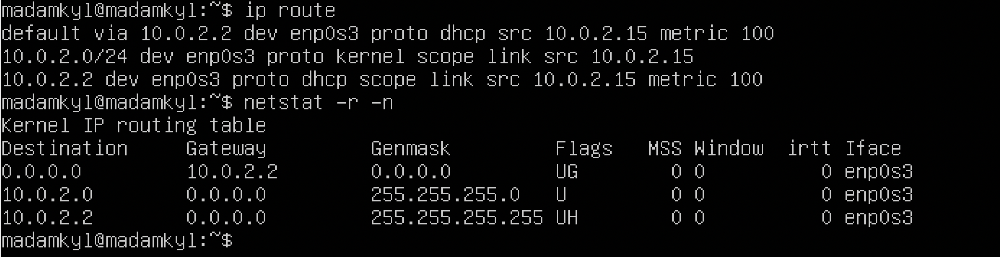
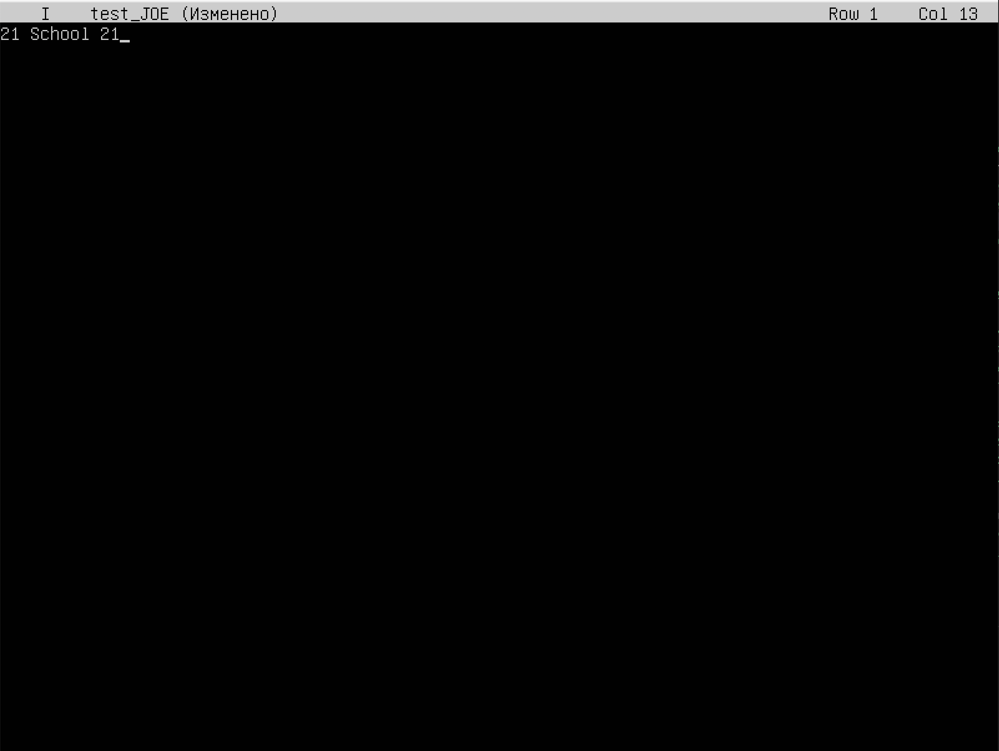
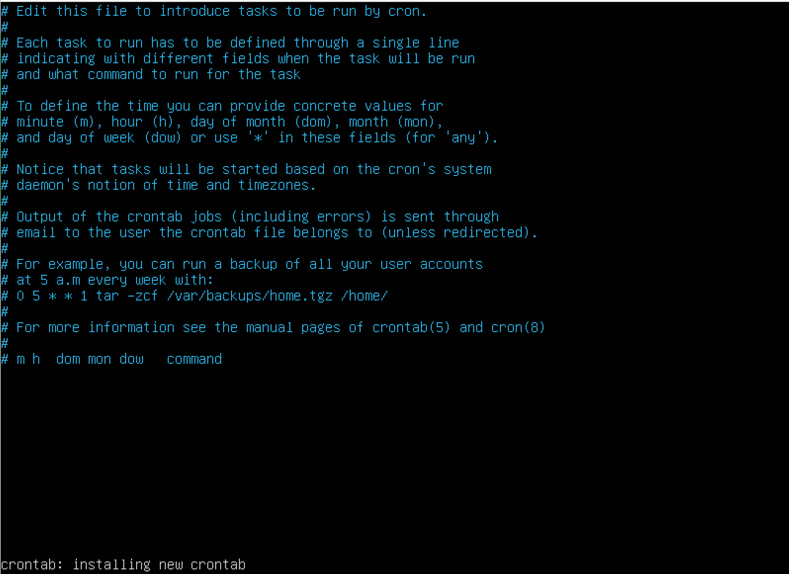

## Part 1
1. установить Ubuntu 20.04 LTS без грфического интерфейса.
* Командой `cat /etc/issue` узнать версию убунты

___
## Part 2
1. Создать пользователя, отличного от пользователя, который создавался при установке. Пользователь должен иметь разрешение на прочтение логов из папки /var/log.

`Добавил нового пользователя sudo useradd -G adm test_user`
* Новый пользователь должен быть в выводе команды 
`cat /etc/passwd`

___
## Part 3
1. Задать им машины вида user-1
  команда: `sudo hostnamectl set-hostname имя` и заменить его на user-1.
2. Поменять дату и время в      зависимости от территориального расположения машины. Команда: 
* `timedatectl` `ls -l /etc/localtime` - показывает информацию о дате, времени и часовом поясе. 
* `sudo timedatectl set-timezone Europe/Moscow`
  

3. Вывести названия сетевых интерфейсов с помощью консольной команды. И дать обьяснение  интерфейсу lo.
* lo - это аппаратный или программный метод, который направляет полученный сигнал или данные обратно отправителю. Он используется как дополнительное средство в исправлении проблем физического соединения.
Команды для вывода lo:
`1. ip link show`
`2. ip addr`
`3. ip -s link`

4. Иcпользуя консольную команду получить ip адресс устройства. На котором я работаю от DHCP сервера. И дать расшифровку DHCP.
* `DCHP` — протокол динамической настройки узла) — прикладной протокол, позволяющий сетевым устройствам автоматически получать IP-адрес и другие параметры, необходимые для работы в сети TCP/IP. Данный протокол работает по модели «клиент-сервер». Для автоматической конфигурации компьютер-клиент на этапе конфигурации сетевого устройства обращается к так называемому серверу DHCP и получает от него нужные параметры. Сетевой администратор может задать диапазон адресов, распределяемых сервером среди компьютеров. Это позволяет избежать ручной настройки компьютеров сети и уменьшает количество ошибок. Протокол DHCP используется в большинстве сетей TCP/IP.
* `ip a` `ip add` `hostname` узнать айпи машины

5. Определить и вывести на экран внешний ip-адрес шлюза (ip) и внутренний IP-адрес шлюза, он же ip-адрес по умолчанию (gw).Команды:

* `ip route` `netstat -r -n` Показывает айпи шлюза

6. Задать статичные (заданные вручную, а не полученные от DHCP сервера) настройки ip, gw, dns (использовать публичный DNS серверы, например 1.1.1.1 или 8.8.8.8).Команды: 
* Для начала узнаем адресс шлюза командой ` ip route show match 0/0`. Айпи адресс наешго шлюза `10.0.2.15` Обычно, в локальных сетях адрес находится в одном из следующих диапазонов:
`1. 10.0.0.0 – 10.255.255.255`
`2. 172.16.0.0 – 172.31.255.255`
`3. 192.168.0.0 – 192.168.255.255`
Нам подходит первый вариант.
* Ввести команду `sudo vim /etc/netplan/00-installer-config.yaml` и внести изменения 
* после сохраняем изменения командой `sudo netplan apply`
перезагружаеи и проверяем ip машины.

7. Перезагрузить виртуальную машину. Убедиться, что статичные сетевые настройки (ip, gw, dns) соответствуют заданным в предыдущем пункте.
* После перезагрузки командой `sudo reboot` находясь в директорий `/etc/netplan`  использовать команду `systemd-resolve --status | grep -i 'DNS Server' -A2`
флаг - `-i` игнорирует нижний регистр.
* Пропинговать командой `ping 1.1.1.1` `ping ya.ru`
___
## Part 4
1. Обновить пакеты убунту
* `sudo apt-get update` Обновляет пакеты системы

___
## Part 5
1. Обьяснить истинное назначение команды sudo
* Команда sudo предоставляет возможность пользователям выполнять команды от имени суперпользователя root, либо других пользователей. Правила, используемые sudo для принятия решения о предоставлении доступа, находятся в файле `/etc/sudoers` (для редактирования файла можно использовать специальный редактор visudo, запускаемый из командной строки без параметров, в том числе без указания пути к файлу); язык их написания и примеры использования подробно изложены в man sudoers).Имя команды означает substitute user do или super user do. Утилита позволяет запускать программы от имени другого пользователя, но чаще всего от имени корневого. Утилита была разработана еще в 1980 году Бобом Когшелом и Клиффом Спенсером. За это время сменилось много разработчиков и было добавлено много функций.
2. Поменять hostname ОС от имени пользователя, созданного в пункте Part 2. (используя sudo).
* В начале потребуется удалить созданного пользователя
`$ sudo deluser --remove-home username`
* выполнить перезагрузку `sudo reboot`
* Создаем нового пользователя `sudo adduser new_user`
Система запросит пароль для нового пользователя. Придумываем и вводим его. Остальное пропускаем через `Enter`.
* Добавляем пользователя new_user в группу sudo:  `sudo usermod -aG sudo new_user`
* Проверяем все ли получилось: Переключим пользователя на new_user и попробуем выполнить команду для смены hostname от имени суперпользователя и изменить user-1 на user-2:
* еще раз сделать перезагрузку `sudo reboot`
`su new_user `

3. Вставить скрин с изменённым hostname в отчёт.
* Скрин с измененным hostname 
___
## Part 6 Установка и настройка службы времени
1. **Настроить службу автоматической синхронизации времени.**

Синхронизация времени по NTP.
* NTP - это протокол синхронизации времени по сети. По существу клиенты запрашивают текущее время на сервере и используют его для установки своих собственных часов.
**Ubuntu использует ntpdate и ntpd.**
**ntpdate**
Ubuntu стандартно устанавливается с ntpdate и будет запускать его при каждой загрузке один раз для установки времени по NTP серверу Ubuntu.
`ntpdate -s ntp.ubuntu.com`

* **ntpd**
Сервис NTP ntpd вычисляет уход наших системных часов и постоянно подправляет их, благодаря чему не происходит сильных изменений, что может приводить к непоследовательности в журналах. Ценой этому небольшое расходование мощности процессора и оперативной памяти, но для современного сервера это несущественно.
**Установка**
Для установки ntpd из терминала вводим: `sudo apt-get install ntp`
2.**Вывести время, часового пояса, в котором вы сейчас находитесь.**
* Команда: `date`

3.**Вывод следующей команды должен содержать NTPSynchronized=yes: timedatectl show**
timedatectl show
* Команда установки: `sudo apt-get install ntp`
* Команда синхронизаций: `ntpdate -s ntp.ubuntu.com`
* Команда вывода: `sudo timedate show`

___
## Part 7
1.Установить текстовые редакторы VIM (+ любые два по желанию NANO, MCEDIT, JOE и т.д.)
* Команда для установки ПО: `sudo apt install vim`

2. Используя каждый из трех выбранных редакторов, создайте файл test_X.txt, где X -- название редактора, в котором создан файл. Напишите в нём свой никнейм, закройте файл с сохранением изменений.

* Открываем текстовый редактор vim 
для выхода с редактора нажимаем `shift+:`. Затем пишем `wq` и нажимаем `ввод`
* Открываем текстовый редактор nano 
для выхода нажимаем `control + X`. Затем выбираем пункт `Yes` и `Ввод`
* Открываем текстовый редактор JOE 
В открывшемся окне редактора Joe вводим свой ник, далее вводим команду `ctrl+K+Х` для сохранения и выхода в консоль терминала.

3. Используя каждый из трех выбранных редакторов, откройте файл на редактирование, отредактируйте файл, заменив никнейм на строку "21 School 21", закройте файл без сохранения изменений.

* В открывшемся окне редактора Vim переходим в режим insert нажатием клавиши i, меняем свой ник на строку 21 School 21, нажимаем esc для перехода в основной режим, далее вводим команду :q! для выхода в консоль терминала без сохранения внесённых изменений.
* В открывшемся окне редактора Nano меняем свой ник на стрроку 21 School 21, далее вводим команду ctrl+X для выхода без сохранения, подтверждаем наше действие ответом на вопрос редактора "Save modified buffer?", выбираем N -> No, выходим в консоль терминала.`ctrl + X` затем `N`
* В открывшемся окне редактора Joe меняем свой ник на строку 21 School 21, далее вводим команду ctrl+C для выхода без сохранения, подтверждаем наше действие ответом на вопрос редактора "Lose changes to this file (y,n,^C)?", выбираем Y -> Yes, выходим в консоль терминала.
3. Используя каждый из трех выбранных редакторов, отредактируйте файл ещё раз (по аналогии с предыдущим пунктом), а затем освойте функции поиска по содержимому файла (слово) и замены слова на любое другое.

* **VIM**
В Vim мы можем найти и заменить текст с помощью команды `:substitute(: s)`.
Чтобы запускать команды в Vim, мы должны находиться в обычном режиме — режиме по умолчанию при запуске редактора. Чтобы вернуться в обычный режим из любого другого режима, просто нажмимаем клавишу `«Esc»`.
Общая форма команды замены следующая:
`:[range]s/{pattern}/{string}/[flags] [count]`
Команда ищет в каждой строке `[range] {pattern}` и заменяет его на `{string}`.
`[count]` — положительное целое число, умножающее команду.
Если нет `[range]` и `[count]`, заменяется только шаблон, найденный в текущей строке. Текущая строка — это строка, в которой находится курсор.
Если мы хотим найти и заменить шаблон во всем файле, используем символ процента в качестве диапазона. Этот символ указывает диапазон от первой до последней строки файла. Чтобы заменить все вхождения шаблона поиска в текущей строке, добавим флаг g.
`%s/foo/bar/g`.

* **nano**
Чтобы в редакторе nano выполнить поиск и замену текста используем сочетание клавиш:
`Ctrl+\`
Нажимаем `Ctrl+`, введим строку, которую необходимо искать и нажимаем клавишу Enter. Затем вводим строку, на которую необходимо произвести замену и нажимаем `Enter`.
После этого появится предложение по замене первого вхождения нашей строки. Мы можем нажать:
`A` — Выполнить автоматическую замену всех вхождений строки;
`Y` — Выполнить замену данной найденной строки (после этого мы переместимся к следующему в хождению искомой строки);
`N` — Отменить замену данной строки (после этого мы переместимся к следующему вхождению искомой строки);
`Ctrl+C `— Прервать поиск.
`Ctrl+`
Search (to replace):
Replace (with):
Replace this instance?
`Y` Yes `A` All
`N` No `^C` Cancel

* **Joe**
Нажимаем `ctrl+K+F`, чтобы выполнить поиск фрагмента текста (строки) вперед или назад. У нас будет запрошен образец поиска. После нажатия Enter мы получим запрос на ввод опций поиска. Мы можем просто нажать Enter еще раз, чтобы редактор сразу начал поиск вперед, или можем ввести одну или больше из следующих опций:
`b` - Поиск назад, а не вперед;
`i` - Не различать при поиске символы верхнего и нижнего регистров. Обычно считается, что они различны;
nnn (где nnn - число) - Если мы введем число - JOE найдет n-ное вхождение искомого текста. Это полезно для перехода в нужные места внутри файлов, структурированных некоторым определенным образом;
`r` - Замещать текст.
Если мы введем опцию r, далее у нас будет запрошен замещающий текст. Каждый раз при нахождении текста у нас будет запрашиваться - желаем ли мы выполнить его замещение. Мы можем нажать:
`y` - для замещения текста и выполнения дальнейшего поиска;
`n` - чтобы не замещать текст, но продолжать поиск;
`r` - для замены всех последующих вхождений далее по файлу без дополнительных запросов на подтверждение, или ^C для прекращения поиска и замены.
Мы можем нажать `^L` для повторения предыдущего поиска.

____
## Part 8 Установка и базовая настройка
1. **Установка службы SSHd** 
* Во-первых, убедимся, что все наши системные пакеты обновлены, выполнив следующие apt команды в терминале:
`$ sudo apt update`
`$ sudo apt upgrade`
Выполним следующую команду, чтобы установить SSH-сервер в системе:
`$ sudo apt-get install ssh`
`$ sudo apt install openssh-server`
После установки пакета сервера SSH демон сервера SSH должен быть запущен. Чтобы проверить состояние вашего SSH-сервера, выполните следующую команду:
`$ sudo systemctl status sshd`SUDO 

2. **Добавить автостарт службы при загрузке системы**
* Для включения автостарта службы воспользуемся командой:
`$ sudo systemctl enable ssh`
3. **Перенастроить службу SSHd на порт 2022.**
* Теперь нам необходимо изменить порт. Это можно сделать, отредактировав файл конфигурации с помощью команды:
`$ nano /etc/ssh/sshd_config`
Откроем файл и найдём строку, определяющую порт:Port 22
Поменяем его на 2022.

Затем перезапустил службу `$ sudo systemctl restart sshd`.
4. **Используя команду ps, показать наличие процесса sshd. Для этого к команде нужно подобрать ключи.**
Утилита ps одна из самых простых и в то же время часто используемых программ для просмотра списка процессов в Linux. Она не поддерживает интерактивный режим, зато имеет множество опций для настройки вывода тех или иных параметров процессов в Linux.
Процесс Linux - это экземпляр программы, запущенный в памяти. Все процессы можно разделить на обычные и фоновые.
Linux - это многопользовательская система, каждый пользователь может запускать одни и те же программы, и даже один пользователь может захотеть запустить несколько экземпляров одной программы, поэтому ядру нужно как-то идентифицировать такие однотипные процессы. Для этого каждому процессу присваивается PID (Proccess Identificator).
Каждый из процессов может находиться в одном из таких состояний:
Запуск - процесс либо уже работает, либо готов к работе и ждет, когда ему будет дано процессорное время;
Ожидание - процессы в этом состоянии ожидают какого-либо события или освобождения системного ресурса. Ядро делит такие процессы на два типа - те, которые ожидают освобождения аппаратных средств и приостановление с помощью сигнала;
Остановлено - обычно, в этом состоянии находятся процессы, которые были остановлены с помощью сигнала;
Зомби - это мертвые процессы, они были остановлены и больше не выполняются, но для них есть запись в таблице процессов, возможно, из-за того, что у процесса остались дочерние процессы.
Рассмотрим общий синтаксис команды, здесь все очень просто:
`$ ps опции`
`$ ps опции | grep параметр`
Во втором варианте мы используем утилиту grep для того, чтобы отобрать нужные нам процессы по определенному критерию.
**Теперь рассмотрим опции утилиты:**
`A, -e` - выбрать все процессы;
`-a` - выбрать все процессы, кроме фоновых;
`-d` - выбрать все процессы, даже фоновые, кроме процессов сессий;
`-N` - выбрать все процессы кроме указанных;
`-С` - выбирать процессы по имени команды;
`-G` - выбрать процессы по ID группы;
`-p` - выбрать процессы PID;
`--ppid` - выбрать процессы по PID родительского процесса;
`-s` - выбрать процессы по ID сессии;
`-t` - выбрать процессы по tty;
`-u` - выбрать процессы пользователя;
`-x` - найти все вхождения строки поиска.
Опции форматирования:
`-с` - отображать информацию планировщика;
`-f` - вывести максимум доступных данных, например, количество потоков;
`-F` - аналогично `-f`, только выводит ещё больше данных;
`-l` - длинный формат вывода;
`-j` - вывести процессы в стиле Jobs, минимум информации;
`-M` - добавить информацию о безопасности;
`-o` - позволяет определить свой формат вывода;
`--sort` - выполнять сортировку по указанной колонке;
`-L` - отображать потоки процессов в колонках LWP и NLWP;
`-m` - вывести потоки после процесса;
`-V` - вывести информацию о версии;
`-H` - отображать дерево процессов.
Мы будем использовать следующую команду:
`$ ps -aux | grep ssh`

5. **Перезапустить систему**
`$ sudo reboot`
**Вывод команды netstat -tan должен содержать tcp 0 0 0.0.0.0:2022 0.0.0.0:* LISTEN (если команды netstat нет, то ее нужно установить).** NETSTAT -TAN
Устанавливаем netstat с использованием команды:
`$ sudo apt install net-tools`
* `netstat` (network statistics) — утилита командной строки, выводящая на дисплей состояние TCP-соединений (как входящих, так и исходящих), таблицы маршрутизации, число сетевых интерфейсов и сетевую статистику по протоколам.

* `-t` - Отображение текущего подключения в состоянии переноса нагрузки с процессора на сетевой адаптер при передаче данных.
`-a` - Отображение всех подключений и ожидающих портов.
`-n` - Отображение адресов и номеров портов в числовом формате.
**TCP/IP** — сетевая модель передачи данных, представленных в цифровом виде. Модель описывает способ передачи данных от источника информации к получателю.
proto - название порта.
Local address - локальный адрес.
Foreign address - внешний адрес, учавствующий в создании соединения.
State - состояние соединения, все варианты.
CLOSE_WAIT - ожидание закрытия соединения.
CLOSED - соединение закрыто.
ESTABLISHED - соединение установлено.
LISTENING - ожидается соединение (слушается порт).
TIME_WAIT - превышение времени ответа.
**Адрес** 0.0.0.0 означает «любой IP данного компьютера» и включает в себя в том числе 127.0.0.1. Адрес 0.0.0.0 обычно означает, что IP адрес ещё не настроен или не присвоен. Такой адрес указывает хост, который обращается к DHCP для получения IP адреса.

## Part 9
1. **ОПЦИИ И КОМАНДЫ TOP.**
Опций запуска у команды не много и использовать их активно не принято, потому что большинство действий выполняются с помощью интерактивных команд. Вот основные опции:
-v - вывести версию программы;
-b - режим только для вывода данных, программа не воспринимает интерактивных команд и выполняется пока не будет завершена вручную;
-c - отображать полный путь к исполняемым файлам команд;
-d - интервал обновления информации;
-H - включает вывод потоков процессов;
-i - не отображать процессы, которые не используют ресурсы процессора;
-n - количество циклов обновления данных, после которых надо закрыть программу;
-o - поле, по которому надо выполнять сортировку;
-O - вывести все доступные поля для сортировки;
-p - отслеживать только указанные по PID процессы, можно указать несколько PID;
-u - выводить только процессы, запущенные от имени указанного пользователя.
С опциями запуска всё, теперь давайте поговорим про интерактивные команды, которые вы можете выполнять во время работы программы.
h - вывод справки по утилите;
q или Esc - выход из top;
A - выбор цветовой схемы;
d или s - изменить интервал обновления информации;
H - выводить потоки процессов;
k - послать сигнал завершения процессу;
W - записать текущие настройки программы в конфигурационный файл;
Y - посмотреть дополнительные сведения о процессе, открытые файлы, порты, логи и т д;
Z - изменить цветовую схему;
l - скрыть или вывести информацию о средней нагрузке на систему;
m - выключить или переключить режим отображения информации о памяти;
x - выделять жирным колонку, по которой выполняется сортировка;
y - выделять жирным процессы, которые выполняются в данный момент;
z - переключение между цветным и одноцветным режимами;
c - переключение режима вывода команды, доступен полный путь и только команда;
F - настройка полей с информацией о процессах;
o - фильтрация процессов по произвольному условию;
u - фильтрация процессов по имени пользователя;
V - отображение процессов в виде дерева;
i - переключение режима отображения процессов, которые сейчас не используют ресурсы процессора;
n - максимальное количество процессов, для отображения в программе;
L - поиск по слову;
<> - перемещение поля сортировки вправо и влево.
* **УПРАВЛЕНИЕ.**
Для работы с утилитой top используются следующие клавиши:
Пробел — обновить вывод
M — сортировка по используемой памяти
P — сортировка по нагрузке на процессор (используется по умолчанию)
T — сортировка по времени работы процесса
A — сортировка по максимальному потреблению различных ресурсов
u — сортировка по имени пользователя (потребуется ввести имя пользователя)
k — завершить процесс (потребуется указать его идентификатор, PID)
n — изменить количество процессов в выводе (потребуется указать нужное количество)
c — вывести полный путь запущенного процесса (столбец COMMAND)
h — вывод справки
q — выход из программы
* **ЗАПУСК ПРОГРАММЫ.**
Утилита не всегда установлена по умолчанию, для её установки в Ubuntu используйте команду:
`$ sudo apt install top`
Затем для запуска просто выполните в терминале:
`$ top`
Окно можно условно разделить на две части. В верхней части находится информация о системе, общем использовании ресурсов процессора и памяти, раздела подкачки, и так далее. В нижней части окна расположен список запущенных процессов с информацией, отсортированных по определённому полю.
Если все процессы не помещаются на одном экране, их можно листать с помощью стрелок вверх и вниз. Если не помещаются все колонки - с помощью стрелок вправо и влево.`
uptime` - время последней перезагрузки. (Смотри скриншот.)

Слева вверху указано текущее время системы, далее:
Up — время работы системы с последнего запуска. -> 1 min
User — количество текущих пользователей. -> 1 user
Load average — средняя нагрузка на сервер: отображаются значения за одну, пять и 15 минут назад. ->0.56 0.39, 0.16
Tasks — общее количество запущенных процессов в разных статусах (running — выполняемые; sleeping — в ожидании; stopped — остановленные; zombie — «зомби», дочерние процессы, ожидающие завершения родительского процесса). -> 102 total, 1 running, 101 sleeping, 0 stopped, 0 zombie
Cpu(s) — процент времени процессора, затраченного на выполнение процессов, в том числе:
us — пользовательские процессы (высокое значение данного показателя может указывать, в том числе, на проблемы в коде сайта, необходимость его оптимизации); -> 0.0
sy — процессы ядра; -> 0.0
id — неиспользуемые ресурсы (чем выше этот показатель, тем лучше); -> 100.0
wa — операции ввода/вывода, т.е. дисковые операции. -> 0.0
Mem, Swap — сведения об использовании оперативной памяти (total — общий объем, free — объем свободной памяти, used — объем использованной памяти). -> Mem total 1983.4, Mem free 1146.7, Mem used 147.6, Swap total 2048, Swap free 2048, Swap used 0.0
Так же, можно воспользоваться непосредственно командой: `$ uptime`

**Команда (утилита) w** — отображает информацию о пользователях которые в настоящее время есть на машине, и их процессов. Внутри заголовка, показывается текущее время, как долго система работает, сколько пользователей в настоящее время вошли в систему, и среднюю нагрузку системы за последние 1, 5 и 15 минут.
`$ w`

Надо сказать, что аналогично утилите top, можно использовать htop, что намного проще. Пользовательский интерфейс программы htop основан на Ncurses. Представление информации действительно чистое. С помощью этого инструмента вы можете фильтровать, управлять и делать другие интересные вещи, связанные с процессами, запущенными в вашей системе. Это отличный инструмент для системных администраторов Gnu / Linux.
`$ htop`

Обозначения столбцов:
PID — идентификатор процесса;
USER — пользователь, запустивший процесс;
PR — приоритет процесса;
NI — измененный приоритет (присвоенный пользователем с помощью команды nice);
VIRT — объем используемой виртуальной памяти (здесь выводится тот объем памяти, который был запрошен процессом, даже если фактически используется меньше);
RES — объем используемой оперативной памяти
SHR — объем памяти, разделяемой с другими процессами (т.е. память, которая может быть использована другими процессами);
S — статус процесса (running — запущен; sleeping — в ожидании; zombie — процесс-«зомби»):top
D = бесперебойный сон;
I = простой (не работает);
R = запущен;
S = спит;
T = остановлен сигналом управления работой;
t = остановлен отладчиком во время трассировки;
Z = зомби.
%CPU — процент использования процессорного времени;
%MEM — процент использования оперативной памяти;
TIME — общее время работы процесса;
COMMAND — имя процесса (команда, которой был запущен процесс).
**Для управления сортировкой можно использовать клавиши M (сортировка по памяти), P (по процессору), T (по времени), аналогично утилите top. Так же можно воспользоваться клавишей F6 -> SortBy.**
При нажатии клавиши F6 экран сменится и будет предоставлен выбор вариантов сортировки. Выбираем необходимый вариант с помощью стрелок ввер, вниз и нажимаем enter.
Отсортируем по PID.

Отсортируем по Percent_CPU

Отсортируем по PERCENT_MEM.

Отсортируем по TIME.

Теперь для данных выводов PID, PERCENT_CPU, PEERCENT_MEM, TIME **выполним фильтрации по процессу sshd. Воспользуемся клавишей F4 -> Filter.**

**Выполним поиск процесса syslog. Отключаем все предыдущие настройки фильтрации, далее, воспользуемся клавишей F3 -> Search.**

**Используя клавишу F2 -> Setup, выполняем добавление пунктов hostname, clock и uptime в панель вывода.**

Настройку требуемых для дополнительного вывода параметров осуществляем с помощью команд консольного меню расположенного в нижней части экрана.
## Part 10
1. **Использование утилиты fdisk**
ОПЦИИ И СИНТАКСИС FDISK
Синтаксис утилиты ничем не отличается от других команд Linux:
`$ fdisk` опции устройство
Ей надо передать опции, согласно действия, которое вы хотите выполнить, а также раздел диска или устройство к которому эти действия надо применить. Давайте теперь рассмотрим опции fdisk:
`-B`, `--protect-boot` - не стирать первые 512 байт диска чтобы не повредить загрузочную запись;
`-L`, `--color` - настройка цветного вывода, возможные значения auto, never или always;
`-l`, `--list` - вывести все разделы на выбранных устройствах или если устройств не задано, то на всех устройствах;
`-o`, `--output` - указывает какие поля данных надо показывать в выводе программы, доступные поля рассмотрим ниже;
`-u`, `--units` - настраивает формат вывода размера разделов, доступные значения: cylinders, sectors, по умолчанию используется sectors;
`-w`, `--wipe` - режим стирания файловой системы или RAID с диска, возможные значения auto, never или always по умолчанию используется auto;
`-W`, `--wipe-partition` - режим стирания файловой системы или RAID из только что созданного раздела. Возможные значения аналогичны предыдущей опции;
`-h`, `--help` - показать справку по утилите;
`-v`, `--version` - опция выводит версию утилиты.
Опции используются для настройки работы утилиты, мы рассмотрели только самые главные, которые могут вам пригодится, теперь перейдём к командам:

`a` - включение или выключения флага boot для раздела;
`d` - удалить раздел;
`F` - показать свободное место;
`l` - вывести список известных типов разделов;
`n` - создать новый раздел;
`p` - вывести таблицу разделов;
`t` - изменение типа раздела;
`i` - вывести информацию о разделе;
`I` и O - записать или загрузить разметку в файл сценария sfdisk;
`w` - записать новую таблицу разделов на диск;
`q` - выйти без сохранения;
`g` - создать пустую таблицу разделов GPT;
`o` - создать пустую таблицу разделов MBR.
Воспользуемся следующей командой:
`$ sudo fdisk -l`

Название жёсткого диска: sda.
Размер жёсткого диска: 10GiB.
Количество секторов: 20971520cd  sectors.
При созданвгии виртуальной машины swap не создавался.
## Part 11.
1.  **КОМАНДА DF LINUX.**
Утилита df поставляется по умолчанию во всех дистрибутивах Linux и имеет очень простой синтаксис. Фактически вы можете просто набрать df и уже получить результат, но чтобы сделать вывод более читаемым используются дополнительные опции. Вот основной синтаксис:
`$ df опции устройство`
Устройство указывать необязательно, но можно указать раздел диска, о котором мы хотим посмотреть информацию. А теперь рассмотрим основные опции утилиты:
`-a`, `--all` - отобразить все файловые системы, в том числе виртуальные, псевдо и недоступные;
`-B` - изменить размер одного блока перед выводом данных, например, можно использовать BM, чтобы вывести все данные в мегабайтах;
`-h` - выводить размеры в читаемом виде, в мегабайтах или гигабайтах;
`-H` - выводить все размеры в гигабайтах;
`-i` - выводить информацию об inode;
`-k` - выводить размеры в килобайтах;
`--output` - использовать специальный формат вывода, если не задано, выводит все поля. Доступны такие варианты: 'source', 'fstype', 'itotal', 'iused', 'iavail', 'ipcent', 'size', 'used', 'avail', 'pcent', 'file' и 'target';
`-P` - использовать формат вывода POSIX;
--total - выводить всю информацию про использованное и доступное место;
`-t`, --type - выводить информацию только про указанные файловые системы;
`-x` - выводить информацию обо всех, кроме указанных файловых систем.
Утилита отображает стандартный набор колонок, но понять в ее выводе что-то с первого раза сложно. Все данные выводятся в килобайтах. Теперь давайте попросим утилиту выводить данные в более читаемом формате:
`$ sudo df`

Размер корневого раздела: 8445316. (Данные выводятся в килобайтах.)
Размер занятого пространства: 2680040. (Данные выводятся в килобайтах.)
Размер свободного пространства: 5316560. (Данные выводятся в килобайтах.)
Процент использования; 34%.
Для получения информации о типе файловой системы воспользуемся следующей командой:
`$ sudo df --output`

Мы видим, что используется файловая система ext4.
Ext4 — журналируемая файловая система, предлагаемая для использования по умолчанию инсталятором Ubuntu, начиная с версии 9.10.
Далее, согласно задания применим команду:
`$ sudo df -Th`

Размер корневого раздела: 8.1G. (Данные выводятся в гигабайтах.)
Размер занятого пространства: 2.6G. (Данные выводятся в гигабайтах.)
Размер свободного пространства: 5.1G. (Данные выводятся в гигабайтах.)
Процент использования; 34%.
Мы видим, что используется файловая система ext4.
Ext4 — журналируемая файловая система, предлагаемая для использования по умолчанию инсталятором Ubuntu, начиная с версии 9.10.
## Part 12. Использование утилиты du
* **Синтаксис м опций команды DU**
Синтаксис команды очень простой. Вам достаточно передать ей опций и путь к папке с которой следует работать:
`du опции /путь/к/папке`
* А вот опции утилиты:
`-a`, `--all` - выводить размер для всех файлов, а не только для директорий, по умолчанию размер выводится только для папок;
`-B`, `--block-size` - указать единицы вывода размера, доступно: K,M,G,T,P,E,Z,Y для 1024 и KB, MB и так далее для 1000;
`-c`, `--total` - выводить в конце общий размер всех папок;
`-d`, `--max-depth` - максимальная глубина вложенности директорий;
`-h`, `--human-readable` - выводить размер в единицах измерения удобных для человека;
`--inodes` - выводить информацию об использованию inode;
`-L`, `--dereference` - следовать по всем символическим ссылкам;
`-l`, `--count-links` - учитывать размер файла несколько раз для жестких ссылок;
`-P`, `--no-dereference` - не следовать по символическим ссылкам, это поведение используется по умолчанию;
`-S`, `--separate-dirs` - не включать размер подпапок в размер папки;
`--si` - выводить размер файлов и папок в системе си, используется 1000 вместо 1024;
`-s`, `--summarize` - выводить только общий размер;
`-t`, `--threshold` - не учитывать файлы и папки с размером меньше указанного;
`--time` - отображать время последней модификации для файла или папки, вместо времени модификации можно выводить такие метки: atime, access, use, ctime;
`-X`, `--exclude` - исключить файлы из подсчёта;
`-x`, `--one-file-system` - пропускать примонтированные файловые системы;
`--version` - вывести версию утилиты.
1. **Запустить команду du.**

2. **Вывести размер папок /home, /var, /var/log (в байтах, в человекочитаемом виде).**
`$ cd ../../`
`$ sudo du home`

`$ sudo du -h home`

`$ sudo du var`

`$ sudo du -h var`

`$ sudo du var/log`

`$ sudo du -h var/log`

3. **Вывести размер всего содержимого в /var/log (не общее, а каждого вложенного элемента, используя).**
`$ sudo du -h var/log/*`

## Part 13. Установка и использование утилиты ncdu.
Ncdu (NCurses Disk Usage) является инструментом командной строки для просмотра и анализа использования дискового пространства на Linux. Он может показать древовидные каталоги и дать отчет о свободном пространстве на нашем диске, используемого в отдельных каталогах. Таким образом, очень легко отследить сколько занимает места файлы / каталоги. Он на самом деле позволяет пользователю сделать это гораздо быстрее, чем менеджеры с графическим интерфейсом.
1. **Установить утилиту ncdu.**
ncdu доступен по умолчанию в Ubuntu, Linux Mint и в репозитории Debian. Чтобы установить выполним команду:
`$ sudo apt-get install nсdu -y`
2. **Вывести размер папок /home, /var, /var/log.**
`$ cd ../../`
`$ ncdu home`

`$ ncdu var`

`$ ncdu var/log`

## Part 14
* **Большинство лог файлов содержится в директории /var/log.**
/var/log/syslog или /var/log/messages содержит глобальный системный журнал, в котором пишутся сообщения с момента запуска системы, от ядра Linux, различных служб, обнаруженных устройствах, сетевых интерфейсов и много другого.
/var/log/auth.log или /var/log/secure — информация об авторизации пользователей, включая удачные и неудачные попытки входа в систему, а также задействованные механизмы аутентификации.
/var/log/dmesg — драйвера устройств. Одноименной командой можно просмотреть вывод содержимого файла. Размер журнала ограничен, когда файл достигнет своего предела, старые сообщения будут перезаписаны более новыми. Задав ключ --level= можно отфильтровать вывод по критерию значимости.
/var/log/alternatives.log — Вывод программы update-alternatives, в котором находятся символические ссылки на команды или библиотеки по умолчанию.
/var/log/anaconda.log — Записи, зарегистрированные во время установки системы.
/var/log/audit — Записи, созданные службой аудита auditd.
/var/log/boot.log — Информация, которая пишется при загрузке операционной системы.
/var/log/cron — Отчет службы crond об исполняемых командах и сообщения от самих команд.
/var/log/cups — Все, что связано с печатью и принтерами.
/var/log/faillog — Неудачные попытки входа в систему. Очень полезно при проверке угроз в системе безопасности, хакерских атаках, попыток взлома методом перебора. Прочитать содержимое можно с помощью команды faillog.
var/log/kern.log — Журнал содержит сообщения от ядра и предупреждения, которые могут быть полезны при устранении ошибок пользовательских модулей встроенных в ядро.
/var/log/maillog/ или /var/log/mail.log — Журнал почтового сервера, используемого на ОС.
/var/log/pm-powersave.log — Сообщения службы экономии заряда батареи.
/var/log/samba/ — Логи файлового сервера Samba, который используется для доступа к общим папкам Windows и предоставления доступа пользователям Windows к общим папкам Linux.
/var/log/spooler — Для представителей старой школы, содержит сообщения USENET. Чаще всего бывает пустым и заброшенным.
/var/log/Xorg.0.log — Логи X сервера. Чаще всего бесполезны, но если в них есть строки начинающиеся с EE, то следует обратить на них внимание.
* **Для каждого дистрибутива будет отдельный журнал менеджера пакетов.**
/var/log/yum.log — Для программ установленных с помощью Yum в RedHat Linux.
/var/log/emerge.log — Для ebuild-ов установленных из Portage с помощью emerge в Gentoo Linux.
/var/log/dpkg.log — Для программ установленных с помощью dpkg в Debian Linux и всем семействе родственных дистрибутивах.
* **И немного бинарных журналов учета пользовательских сессий.**
/var/log/lastlog — Последняя сессия пользователей. Прочитать можно командой last.
/var/log/tallylog — Аудит неудачных попыток входа в систему. Вывод на экран с помощью утилиты pam_tally2.
/var/log/btmp — Еже один журнал записи неудачных попыток входа в систему. Просто так, на всякий случай, если вы еще не догадались где следует искать следы активности взломщиков.
/var/log/utmp — Список входов пользователей в систему на данный момент.
/var/log/wtmp — Еще один журнал записи входа пользователей в систему. Вывод на экран командой utmpdump.
1. **Написать в отчёте время последней успешной авторизации, имя пользователя и метод входа в систему.**

    
В данном случае мы видим:
*  время последне успешной авторизации -> Jun 9 21:32:25 2022;
*  имя пользователя -> madamkyl;
*  метод входа в систему -> tty1.

* Прежде чем идти дальше, мы посмотрим, что такое TTY.
Как упоминалось в ответе на форуме AskUbuntu, слово TTY появилось из TeleTYpewriter.
Еще в ранние дни Unix пользовательские терминалы, подключенные к компьютерам, были электромеханическими телепринтерами или телетайпами (tty вкратце).
С тех пор имя TTY продолжает использоваться для консолей с текстом. В настоящее время все текстовые консоли представляют собой виртуальные консоли, а не физические консоли. Команда TTY печатает имя файла терминала, подключенного к стандартному входу.
Переключение между TTY в Linux
По умолчанию в Linux есть 7 tty.
Они известны как tty1, tty2 … .. tty7.
От 1 до 6 tty – только командная строка.
7th tty – графический интерфейс (ваш рабочий стол X).
Вы можете переключаться между различными TTY, используя клавиши CTRL + ALT + Fn, для MAC OS option + стрелка влево/вправо.
** 2. Перезапустить службу SSHd.**
Команда systemctl довольно хорошо известна среди пользователей Linux, когда речь идет о включении, отключении, остановке и запуске любой службы. Итак, мы сначала использовали команду systemctl, чтобы включить сервер ssh. Ключевым здесь является слово «enable», наряду с ключевым словом «ssh». Он включит ssh-сервер, синхронизировав скрипт sysv. Вывод этой команды показан ниже на изображении.
`$ sudo systemctl enable ssh`

Теперь он включен и готов к запуску. Таким образом, команда systemctl будет использоваться еще раз для запуска службы ssh. После запуска службы ssh мы должны проверить, правильно ли она активна и работает. Для этого снова использовался тот же systemctl. В обеих командах есть разница только в одном слове, т. е. start и status. Вывод показывает, что служба Openssh в настоящее время активна и работает правильно.
`$ sudo systemctl start ssh`
`$ sudo systemctl status ssh`

Чтобы проверить статус службы ssh, вы также можете использовать ключевое слово sshd вместо ssh, как показано ниже.
`$ sudo systemctl status sshd`

## Part 15 **Использование планировщика заданий CRON.**
**УСТАНОВКА CRONE.**
Почти в каждом дистрибутиве Linux cron в каком-то виде установлен по умолчанию. Но если на вашей машине демона cron нет, вы можете установить его с помощью менеджера пакетов.
Затем установите cron с помощью этой команды:
`$ sudo apt install cron`
Также нужно запустить программу в фоновом режиме:
`$ sudo systemctl start cron`

Системным администраторам, да и обычным пользователям часто приходится автоматизировать различные задачи по обслуживанию и работе с Linux с помощью скриптов. Это очень удобно, вы просто запускаете скрипт, и он делает все что необходимо без вашего вмешательства. Следующий шаг в этом пути - настроить автоматически запуск нужного скрипта в нужное время.

Именно для этих задач в Linux используется системный сервис cron. Это планировщик, который позволяет выполнять нужные вам скрипты раз в час, раз в день, неделю или месяц, а также в любое заданное вами время или через любой интервал. Программа часто используется даже другими службами операционной системы.

Фактически, Cron - это сервис, как и большинство других сервисов Linux, он запускается при старте системы и работает в фоновом режиме. Его основная задача выполнять нужные процессы в нужное время. Существует несколько конфигурационных файлов, из которых он берет информацию о том что и когда нужно выполнять. Сервис открывает файл /etc/crontab, в котором указаны все нужные данные. Часто, в современных дистрибутивах там прописан запуск утилиты run-parts, которая запускает нужные скрипты из следующих папок:
* /etc/cron.minutely - каждую минуту;
* /etc/cron.hourly - каждый час;
* /etc/cron.daily - каждый день;
* /etc/cron.weekly - каждую неделю;
* /etc/cron.monthly - каждый месяц.
В этих папках должны находиться скрипты, которые нужно выполнять с указанным интервалом. Скрипты должны иметь права на выполнение и их имя не должно содержать точки. Это очень сильно облегчает работу с планировщиком для новых пользователей. Также в файле crontab прописан запуск команды anacron, которая работает так же как и cron, только предназначена для задач, которые нужно выполнять раз в длительный период, например, раз в день, неделю, месяц, год.

Она позволяет выполнять их даже если компьютер работает не всегда и время от времени выключается. Дата выполнения задания последний раз записывается в файл /var/spool/anacron, а затем, при следующем запуске anacron проверяет был ли запущен нужный процесс в нужное время, и если нет, то запускает его. Сам же сервис cron больше рассчитан на выполнение задач в течение дня или с точно расписанным временем и датой.
**НАСТРОЙКА CRON.**
Для настройки времени, даты и интервала когда нужно выполнять задание используется специальный синтаксис файла cron и специальная команда. Конечно, вы всегда можете отредактировать файл /etc/crontab, но этого делать не рекомендуется. Вместо этого, есть команда crontab:
`$ crontab -e`
Ее всегда желательно выполнять с опцией -e, тогда для редактирования правил будет использован ваш текстовый редактор по умолчанию. Команда открывает вам временный файл, в котором уже представлены все текущие правила cron и вы можете добавить новые. После завершения работы команды cron файл будет обработан и все правила будут добавлены в /var/spool/cron/crontabs/имя_пользователя причем добавленные процессы будут запускаться именно от того пользователя, от которого вы их добавляли.

Поэтому тут нужно быть аккуратным, и если вам нужно выполнять скрипты от рута, то и crontab нужно выполнить от рута, а не от пользователя. Это часто становится причиной проблем.

**СИНТАКСИС CRONTAB.**
Как я уже говорил, время задается особым синтаксисом, давайте рассмотрим синтаксис настройки одной задачи cron:
минута час день месяц день_недели /путь/к/исполняемому/файлу
Нужно сказать, что обязательно нужно писать полный путь к команде, потому что для команд, запускаемых от имени cron переменная среды PATH будет отличаться, и сервис просто не сможет найти вашу команду. Это вторая самая распространенная причина проблем с Cron. Дата и время указываются с помощью цифр или символа '*'. Этот символ означает, что нужно выполнять каждый раз, если в первом поле - то каждую минуту и так далее.
Вы можете захотеть не указывать отдельно время, а просто указать интервал, с которым нужно запускать скрипт, например, раз в 10 минут. Для этого используется разделитель косая черта - "/":
*/10 * * * * /usr/local/bin/serve
Для формирования отчёта данные по работе команды uptime будем записывать в файл:
crone_test.txt

**UPTIME.**
Синтаксис для команды uptime следующий:
`uptime [OPTIONS]`
Чтобы отобразить время работы системы, вызовите команду без каких-либо опций:
`$ uptime`
Вывод будет выглядеть примерно так:
21:43:52 up 45 min, 1 user, load average: 0.00, 0.00, 0.35
* 21:43:52 — текущее системное время.
* up 8 min — это время, в течение которого система работала.
* 1 user количество зарегистрированных пользователей.
* load average: 0.66, 0.62, 0.35 — средние значения загрузки системы за последние 1, 5 и 15 минут.

Средняя нагрузка на Linux может немного сбивать с толку. В отличие от других операционных систем, которые показывают средние значения загрузки процессора, Linux показывает средние значения загрузки системы.
Средняя загрузка системы измеряет количество заданий, которые в данный момент выполняются или ожидают дискового ввода-вывода. В основном это говорит о том, насколько занята ваша система в течение заданного интервала.
Если средние значения нагрузки равны 0,0, то система в основном простаивает. Если среднее значение нагрузки за последние 1 минуту выше, чем среднее значение за 5 или 15 минут, то нагрузка увеличивается, в противном случае нагрузка уменьшается. Средняя нагрузка увеличивается из-за более высокой загрузки процессора, нагрузки на диск.
Открываем через некоторое время наш файл crone_test.txt и видим результат работы команды с интервалом в две минуты.

Теперь в системном журнале проверим наличие записей о работе вызовов команды используя следующую команду с перенапрвлением данных в файл cron_data.txt:
`$ sudo grep CRON /var/log/syslog > cron_data.txt`

Удаляем все задания из планировщика заданий:

`$ cronetab -e`

